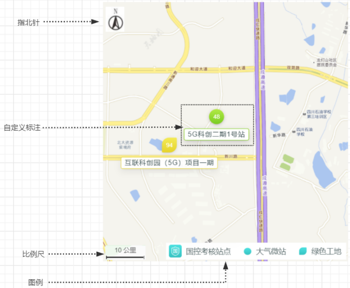
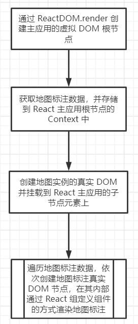
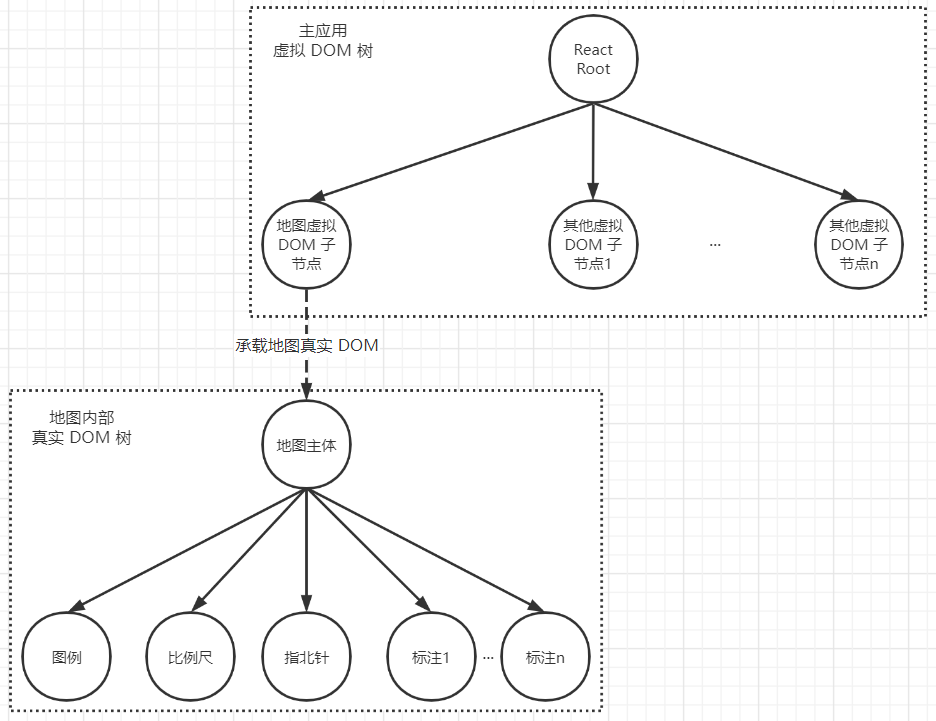
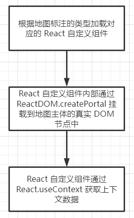
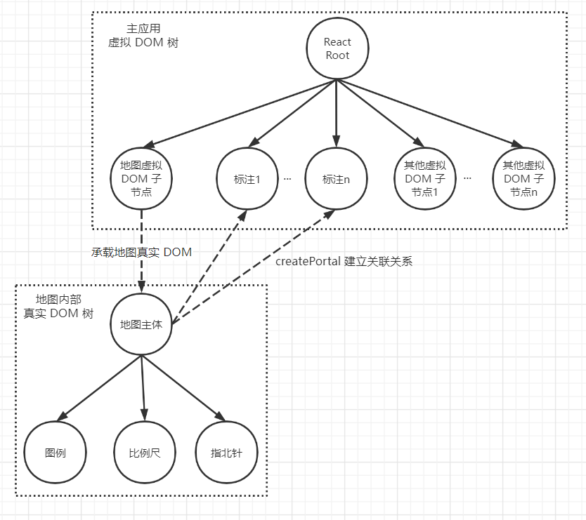

# **背景**

随着互联网用户消费内容和交互方式的升级，Web 地图技术的使用日趋广泛，地图展示的个性化要求也日益提升。目前各种地图 API（如 Mapbox、百度地图、高德地图、Arcgis 等）都支持在地图上绘制标注，且这些标注都支持自定义图案形状、文字的组合，其方案大都是通过指定图片 URL 或者 HTML 代码片段实现的。

以 React 为代表的框架，通常以组件化的方式进行开发。React 底层会引入虚拟 DOM 的机制，而不是让开发者直接操作真实 DOM。在地图相关业务中，会涉及地图自定义标注的开发，对于 React 开发者而言，自然希望通过 React 组件化的方式实现地图的自定义标注。但地图原生 API 通常并不支持通过组件化的方式渲染地图标注。

为了解决上述问题，我们提供一种思路，通过 React 组件化的方式实现地图自定义标注的绘制。此外，还要让地图标注组件能共享主应用的上下文数据。

# **技术方案**

一个典型的地图由如下几部分组成：

- 地图主体：即整张地图；
- 指北针；
- 比例尺；
- 图例；
- 标注：地图上个性化程度较大的部分，如：包含图标形状、数字、名称等数据信息（这些数据信息通常要从应用上下文中获取）。

 

​			图 1 地图组成部分

> [!NOTE]
>
> 说明：以下步骤提到的 API 主要基于 React 17 版本。

主流程实现步骤：

1）通过 ReactDOM.render 创建主应用的虚拟 DOM 根节点。

2）获取地图标注数据，并存储到 React 主应用根节点的 Context Provider 中。

> [!NOTE]
>
> 标注数据通常是发送 Ajax 请求从服务端获取，再存入 Context Provider 中。

3）调用地图 API 创建地图实例的真实 DOM 并挂载到 React 主应用的虚拟 DOM 子节点上。

> [!NOTE]
>
> 主流地图 API 创建的地图实例只能是真实 DOM，故该步骤实际是 React 虚拟 DOM 与地图真实 DOM 的衔接方法。

4）遍历地图标注数据，依次创建地图标注真实 DOM 节点，在其内部通过 React 组定义组件的方式渲染地图标注。

> [!NOTE]
>
> 通过地图 API 创建的内部元素（指北针、图例、比例尺、标注）通常也只能是真实 DOM 节点。

整体流程如下图：

 

​			图 2 主流程图

完成图2的主流程后，形成下图的 DOM 结构：

 

​			图 3 整体的 DOM 树结构

图 3 的结构有如下特性：

1）从最上层创建的 React 根节点以及其下的子节点（地图虚拟 DOM 子节点、其他虚拟 DOM 子节点）都是虚拟 DOM 节点，这些虚拟 DOM 节点在同一棵 React 树上，可以共享主应用 React 根节点的上下文（Context）数据。

2）地图主体只能是真实 DOM 节点，其下的子节点也都是真实 DOM 节点，这些真实 DOM 节点不在同一棵 React 树上，不能共享主应用 React 根节点的上下文（Context）数据。

完成图2的步骤并形成图 3 的结构后，为通过 React 组件化绘制地图自定义标注提供了先决条件，但还不能实现地图标注共享主应用的上下文（Context）数据。

要实现地图标注可以共享主应用的上下文（Context）数据，需要对图 2 中的步骤 4 进一步设计一个子流程，该子流程具体步骤如下：

1）根据地图标注的类型加载对应的 React 自定义组件。

> [!NOTE]
>
> 需要预先开发好各种类型的地图标注，以 React 自定义组件的方式封装起来，在运行时通过标注类型来找到对应的 React 自定义组件，并加载到内存中。

2）React 自定义组件内部通过 ReactDOM.createPortal 挂载到地图主体的真实 DOM 节点中。

> [!NOTE]
>
> 通过 ReactDOM.createPortal 实现了将 React 自定义组件创建为 Portal，它提供了一种将子节点渲染到存在于父组件以外的真实 DOM 节点的方案。

3）React 自定义组件通过 React.useContext 获取上下文数据。

> [!NOTE]
>
> React.useContext 可以让自定义组件获取同一棵 React 树的上下文（Context）数据。

子流程的步骤如下图：

 

​		图 4 通过Portal机制共享上下文数据的子流程

经过图 4 的子流程步骤后，形成下图的 DOM 结构：

​		图 5 通过Portal机制后形成的DOM树结构

图 3 与图 5 在物理结构上是一致的，即标注渲染后仍然会呈现在地图主体内部。

图 3 与图 5 在逻辑结构上是有区别的，其中地图标注节点经过 Portal 机制之后，与 React 根节点在同一棵 React 树中，即标注节点可以获取主应用的上下文（Context）数据。
